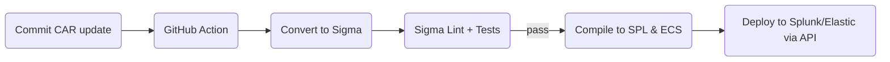

> “CAR gives you the logic, Sigma gives you the transport—translate once and you
> can deploy everywhere.”  
> — Senior Detection Engineer

## 1 • Why Translate?

| Requirement                      | CAR (Markdown / JSON) | Sigma (YAML) |
|----------------------------------|-----------------------|--------------|
| **Human‑Readable Rationale**     | ✔ (analytic.md)      | —            |
| **Portable Rule Syntax**         | —                     | ✔ (ECS/CIM) |
| **SIEM Auto‑Deploy**             | —                     | ✔ via `sigmac`/S2A |
| **ATT&CK Alignment**             | ✔ (`attack.technique`)| ✔ (`tags:`) |

Goal: **merge** CAR’s research depth with Sigma’s deployment portability.

---

## 2 • Field‑Mapping Cheat‑Sheet

| CAR JSON Field        | Sigma Key                         |
|-----------------------|-----------------------------------|
| `attack.technique`    | `tags: - attack.<tactic>.<id>`    |
| `coverage.data_source`| `logsource: product, service`     |
| `query.type`          | `detection: selection:` language  |
| `id` + `title`        | `title:` & `id:` (custom)         |
| `references[]`        | `references:`                     |

---

## 3 • Automated Converter (Python)

```python
import yaml, json, sys, re, pathlib, datetime

def car_to_sigma(car_json):
    with open(car_json) as f:
        cj = json.load(f)

    tactic = cj['attack']['tactic']
    tech   = cj['attack']['technique']
    query  = cj['query']['content']
    query_type = cj['query']['type']

    sigma = {
      'title': cj['title'],
      'id': cj['id'],
      'status': 'experimental',
      'description': cj.get('description','CAR translation'),
      'references': cj['references'],
      'logsource': {
        'product': 'windows',
        'service': 'sysmon'
      },
      'detection': {
        'selection': { 'query': query },   # placeholder
        'condition': 'selection'
      },
      'falsepositives': ['Tuning required'],
      'level': 'high',
      'tags': [f'attack.{tactic}.{tech.lower()}']
    }

    # Convert CAR SPL to Sigma selection if possible
    if query_type.lower() == 'spl':
        pattern = re.search(r'Image="([^"]+)"', query)
        if pattern:
            sigma['detection']['selection'] = {
               'Image': pattern.group(1)
            }
    out = pathlib.Path(car_json).stem + '.yml'
    with open(out, 'w') as y:
        yaml.safe_dump(sigma, y, sort_keys=False)
    print(f"[+] {out} written")

if _name_ == '_main_':
    car_to_sigma(sys.argv[1])

```
*Usage* `python convert.py car/analytics/CAR-2013-05-001.json`

---

## 4 • Example Output

```yaml
title: Command Shell Network Connection
id: CAR-2013-05-001
status: experimental
description: CAR translation
references:
  - https://www.fireeye.com/...
logsource:
  product: windows
  service: sysmon
detection:
  selection:
    Image: '*\cmd.exe'
  condition: selection
falsepositives:
  - Tuning required
level: high
tags:
  - attack.execution.t1059.003
```

```bash
# Compile to Splunk SPL
sigmac -t splunk CmdShell.yml
```

---

## 5 • Quality‑Assurance Checklist

| Test                               | Method                           | Pass Criteria |
|------------------------------------|----------------------------------|---------------|
| **YAML Schema Lint**               | `yamllint`                       | 0 errors      |
| **ATT&CK Tag Validity**            | Regex `attack\.[a-z]+\.\d{4}`    | Matches       |
| **Logsource Mapping**              | Internal field map CSV           | All resolved  |
| **Unit Simulation**                | Atomic Red Team ID match         | Detection hit |
| **Version Pin**                    | Rule header `car_commit:`        | SHA present   |

---

## 6 • CI/CD Pipeline Sketch



Failure at **D** blocks deployment; analyst reviews PR.

---

## 7 • Best Practices

1. **Namespace IDs** – prepend `CAR-` to avoid UUID collision with other Sigma sets.  
2. **Traceability Tags** – add `car.id:<ID>` and `car.version:<hash>` in `tags:`.  
3. **Dual Mappings** – include both CIM (`process_name`) & ECS (`process.name`) in `detection`.  
4. **Auto‑Score** – inherit CAR coverage score (High, Medium) into Sigma `level:`.  
5. **Community Contribution** – PR your Sigma back to **car-sigma-hub** repos.

---

<div class="post-resources container">
  <h3>Resources</h3>
  <ul>
    <li><a href="https://github.com/mitre-attack/car" target="_blank">MITRE CAR Repository</a></li>
    <li><a href="https://github.com/SigmaHQ/sigma" target="_blank">Sigma Rule Spec</a></li>
    <li><a href="https://sigmac.readthedocs.io/en/latest/" target="_blank">sigmac Compiler</a></li>
    <li><a href="https://github.com/Neo23x0/sigma/pull/1075" target="_blank">CAR → Sigma Example PR</a></li>
  </ul>
</div>

<a href="{{ site.baseurl }}/modules/10/splunk-elastic-deploy/" class="next-link">10.3 Splunk / Elastic Deployment →</a>