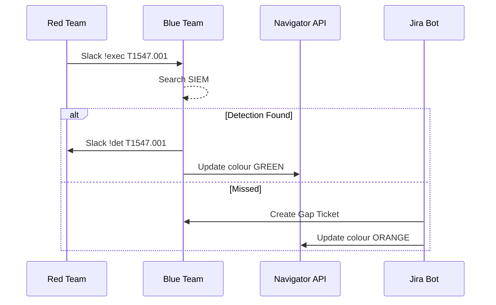

> “Purple‑team isn’t a meeting—it’s an instrumented battlefield where both
> sides learn faster.”  
> — Director of Cyber Resilience

## 1 • Roles & Responsibilities

| Function   | Key Tasks During Session                      |
|------------|-----------------------------------------------|
| **Red Lead** | Execute playbook steps, record exact commands |
| **Blue Lead**| Monitor SIEM/EDR, flag detections & misses   |
| **Purple Facilitator** | Time‑box phases, update live ATT&CK layer |
| **Scribe**  | Capture chat decisions, false‑positive notes |

One facilitator can cover both scribe duties if tooling is automated.

---

## 2 • Tool Stack

| Need                     | Recommended Tool                               |
|--------------------------|------------------------------------------------|
| **Live Layer Sharing**   | **ATT&CK Navigator Multi‑User** (self‑host)    |
| **Comms / Screen Share** | MS Teams / Zoom with breakout for side chats   |
| **Evidence Streaming**   | Splunk / Elastic dashboards on shared screen   |
| **Note‑Taking**          | Obsidian vault synced to Git (markdown)        |

**Navigator Multi‑User** supports **WebSocket updates**—red marks executed
techniques in **orange**, blue marks detected ones in **green**.

---

## 3 • Real‑Time Workflow (`T+0` = session start)

| Time | Red Action                               | Blue Reaction                          | Layer Colour |
|------|------------------------------------------|----------------------------------------|--------------|
| T+5 m| Launch PowerShell loader (`T1059.001`)   | Detect via Sysmon 4104 alert           | Green        |
| T+9 m| Create Run‑key persistence (`T1547.001`) | No detection                           | Orange       |
| T+15 m| Dump LSASS with nanodump (`T1003.001`)  | EDR flags signature → containment      | Green        |

Facilitator updates layer colours using **hotkeys**:

```text
CTRL + 1  = executed
CTRL + 2  = detected
CTRL + 3  = mitigated (patched mid‑exercise)
```

---

## 4 • Communication Cadence

1. **Execute → Signal**  
   - Red posts `!exec T1059.001 OK` in #ops Slack channel.  
   - Triggered by wrapper script around each step.  

2. **Detection Declaration**  
   - Blue replies `!det T1059.001 Hit alert=PS_DL` with Splunk link.  

3. **Gap Ticket**  
   - If `!det` absent in 3 min, bot auto‑opens Jira “Detection Gap” ticket.  

4. **Layer Update**  
   - Bot calls Navigator API `PUT /techniques/<id>/score`.

---

## 5 • Workflow Diagram



---

## 6 • Metrics to Capture

| Metric                      | Computation                                   | Target |
|-----------------------------|-----------------------------------------------|--------|
| **Detection Ratio**         | `detected_steps / executed_steps`             | ≥ 80 % |
| **Mean Time‑to‑Detect**     | Avg seconds between `!exec` and `!det`        | ≤ 120 s |
| **False Positive Count**    | Blue alerts not tied to red action            | ≤ 3    |
| **Gap Closure SLA**         | Days until Jira ticket closed with new rule   | ≤ 14 d |

Grafana pulls from Redis channel logs; weekly PDF sent to execs.

---

## 7 • Post‑Session Artefacts

1. **Navigator Layer** – colour‑coded JSON (`purple_session_2025‑07‑15.json`).  
2. **Command Transcript** – auto‑export Slack #ops history to markdown.  
3. **Detection Logs** – Splunk saved search results (`csv`).  
4. **Gap Ticket Summary** – Jira filter `project=DET AND createdDate>=-1d`.  
5. **Video Recording** – screen capture for training archive.

All artefacts stored in Git LFS under `/purple-sessions/YYYY/MM/`.

---

## 8 • Best Practices

| Topic               | Recommendation                                          |
|---------------------|---------------------------------------------------------|
| **Pre‑Session ROE** | Agree max dwell, payload class, no prod creds.          |
| **Bot Automation**  | Reduce human lag—Slack bot parses `!exec` / `!det`.     |
| **Gamify**          | Award points: +2 detection, +1 mitigation, –1 FP.       |
| **Rotate Actors**   | Swap red & blue roles quarterly for empathy building.   |
| **Instant Debrief** | 15‑min huddle right after session—capture hot‑fix ideas.|

---

<div class="post-resources container">
  <h3>Resources</h3>
  <ul>
    <li><a href="https://mitre-attack.github.io/attack-navigator/" target="_blank">ATT&CK Navigator</a></li>
    <li><a href="https://github.com/preludeorg/operator" target="_blank">Prelude Operator (Purple automation)</a></li>
    <li><a href="https://github.com/cyberark/pplx-splunkbot" target="_blank">Example Slack → Splunk Bot</a></li>
  </ul>
</div>

<a href="{{ site.baseurl }}/modules/11/post-exercise-reporting/" class="next-link">11.5 Post‑Exercise Reporting →</a>