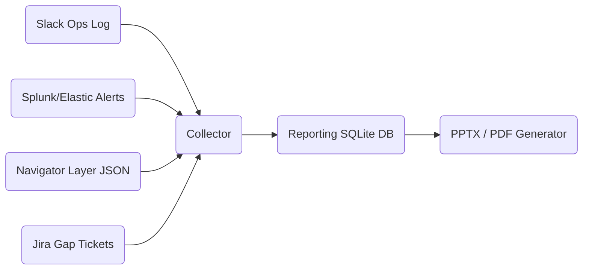

> “If it isn’t documented, it never happened—and if leaders can’t understand
> it, nothing will change.”  
> — Cyber Program Manager

## 1 • Reporting Objectives

| Audience        | Key Questions Answered                       | Deliverable                |
|-----------------|----------------------------------------------|----------------------------|
| **Executives**  | How resilient are we?  What improved?        | 3‑slide metrics deck       |
| **SOC Leads**   | Which rules fired?  Where are gaps?          | Heat‑map + Jira backlog    |
| **System Owners**| Which hosts / apps were vulnerable?         | Asset‑specific findings    |
| **Red/Blue Teams** | What worked, what failed, next steps?    | Full technical after‑action |

---

## 2 • Artefact Aggregation Workflow



*Collector* script normalises artefacts into `events`, `detections`,
`tickets`, `layer` tables.

---

## 3 • Core Metrics

| Metric                         | SQL Query Example (SQLite DB)                 | Target |
|--------------------------------|----------------------------------------------|--------|
| **Detection Ratio**            | `SELECT SUM(detected)/COUNT(*) FROM steps`   | ≥ 80 % |
| **Mean Time‑to‑Detect (s)**    | `AVG(det_time - exec_time)`                  | ≤ 120  |
| **False Positives**            | `COUNT(*) FROM alerts WHERE red_step IS NULL`| < 3    |
| **Gap Closure Velocity**       | `AVG(close_date - open_date)` on Jira issues | ≤ 14 d |

---

## 4 • Heat‑Map Slide (Python Example)

```python
from mitreattack.navlayers import Layer
from pptx import Presentation
from pptx.util import Inches
layer = Layer().from_file("purple_session_2025-07-16.json")
img = layer.render_png("heatmap.png")        # requires navlayers 5.0+

prs = Presentation()
title = prs.slides.add_slide(prs.slide_layouts[5])
title.shapes.title.text = "Purple‑Team Technique Coverage"
blank = prs.slides.add_slide(prs.slide_layouts[6])
blank.shapes.add_picture("heatmap.png", Inches(0.5), Inches(1.0), width=Inches(9))
prs.save("Purple_Report.pptx")
```

*Result*: title + full‑screen matrix image, auto‑generated after every session.

---

## 5 • Timeline & Latency Chart

| Time (UTC) | Technique | Detected | Latency (s) |
|------------|-----------|----------|-------------|
| 13 : 22 : 11 | T1059.001 | ✔ | 44          |
| 13 : 27 : 05 | T1003.001 | ✔ | 18          |
| 13 : 31 : 09 | T1547.001 | ✖ | —           |

Plot latency distribution (box‑and‑whisker) in Grafana; embed PNG in report.

---

## 6 • Executive Summary Template

| Section              | Content                                                   |
|----------------------|-----------------------------------------------------------|
| **Objective**        | Validate detection of APT29 techniques across 8 hosts     |
| **Overall Score**    | Detection 82 % (↑ 12 % vs last quarter)                   |
| **Key Gaps**         | Registry Run‑key (`T1547.001`), Named‑Pipe SMB (`T1021`)  |
| **Remediation Plan** | Deploy Sysmon 13 config; new Sigma rule ETA 10 days       |
| **Business Impact**  | Reduced mean time‑to‑detect from 4 min to 90 s            |

---

## 7 • Technical Debrief Checklist

- [x] **Rule Performance** table with TP / FP counts  
- [x] PCAP & Sysmon bundles zipped in `/evidence/YYYY‑MM‑DD`  
- [x] Gap Jira tickets include ATT&CK ID, affected log source, owner  
- [x] Next purple‑team date booked (within 90 days)

---

## 8 • Automate PDF Generation (Pandoc)

```bash
pandoc exec_summary.md -o Purple_Summary_2025‑07‑16.pdf \
       --template eisvogel --highlight-style tango

```
Attach PDF + `Purple_Report.pptx` to Confluence page `Purple‑Sessions/2025‑07‑16`.

---

## 9 • Best Practices

| Area             | Guidance                                                    |
|------------------|-------------------------------------------------------------|
| **Evidence Tags**| Prefix every file with `YYYYMMDD_<playbook_id>_host`        |
| **Metric Trends**| Include 4‑quarter rolling charts to show program progress   |
| **Glossary**     | Append ATT&CK ID → plain‑English table for exec readability |
| **Data Retention**| Store artefacts 3 years, then archive per IR policy        |
| **Red/Blue Sign‑off**| Both leads approve final PDF before distribution       |

---

<div class="post-resources container">
  <h3>Resources</h3>
  <ul>
    <li><a href="https://pandoc.org/" target="_blank">Pandoc Document Converter</a></li>
    <li><a href="https://python-pptx.readthedocs.io/" target="_blank">python‑pptx Library</a></li>
    <li><a href="https://mitre-attack.github.io/attack-navigator/" target="_blank">ATT&CK Navigator Export Docs</a></li>
  </ul>
</div>

<a href="{{ site.baseurl }}/modules/11/atomic-red-team-lab/" class="next-link">11.6 Atomic Red Team Lab →</a>