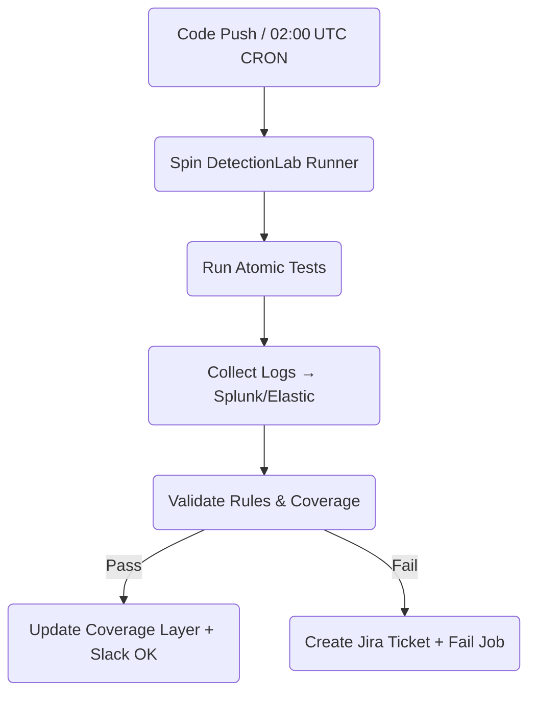

> “Auditors ask, *‘Show me the evidence.’*  
> CI says, *‘Here’s the JSON, fresh from last night’s run.’*”  
> — Continuous Compliance Engineer  

---

## 1 • What We’re Automating

| Step                        | Manual Pain                | CI Solution                                  |
|-----------------------------|----------------------------|----------------------------------------------|
| Select high‑risk ATT&CK IDs | Spreadsheet triage         | Pull top‑risk list from **risk_scores.json** |
| Launch technique tests      | RDP + copy/paste scripts   | **Atomic Runner** GitHub Action              |
| Verify detections fired     | SIEM console clicking      | **splunk‑validate.py** API script            |
| Document evidence           | Screenshots in Word        | JSON artefact + Navigator layer export       |
| Open remediation tickets    | Copy/paste into Jira       | Auto‑create via REST if test fails           |

Goal: nightly pipeline, zero human touch, auditable artefacts.

---

## 2 • High‑Level Pipeline



---

## 3 • GitHub Actions Workflow

```yaml
name: Control‑Audit
on:
  workflow_dispatch:
  schedule: [{ cron: "0 2 * * *" }]
jobs:
  audit:
    runs-on: detectionlab  # self‑hosted runner
    steps:
      - uses: actions/checkout@v4
      - name: Select High‑Risk Techniques
        run: python scripts/select_top_risk.py risk_scores.json > techlist.txt
      - name: Run Atomics
        uses: redcanaryco/invoke-atomic-red-team-action@v1
        with:
          technique-file: techlist.txt
          cleanup: true
      - name: Validate Detections
        run: python scripts/splunk_validate.py techlist.txt --threshold 0.8
      - name: Build Coverage Layer
        run: python scripts/update_layer.py
      - name: Upload Artefacts
        uses: actions/upload-artifact@v4
        with:
          name: audit-artefacts
          path: |
            reports/*
            layers/*
```

`select_top_risk.py` picks top‑10 techniques whose **risk > 12** and **coverage
< 0.8**.

---

## 4 • `splunk_validate.py` (Core Logic)

```python
import sys, json, requests, csv, datetime, os
SPLUNK = os.environ['SPLUNK_HOST']
TOKEN  = os.environ['SPLUNK_HEC']

def fired(tid):
    q = f"search index=main attack.technique_id={tid} earliest=-4h | head 1"
    r = requests.post(f"https://{SPLUNK}:8089/services/search/jobs/export",
                      auth=('admin',TOKEN), data={'search':q,'output_mode':'json'})
    return any("results" in line for line in r.text.splitlines())

failed = []
for tid in open(sys.argv[1]):
    tid = tid.strip()
    if not fired(tid):
        failed.append(tid)

if failed:
    print("[!] Gaps:",failed)
    open("reports/gaps.json","w").write(json.dumps(failed,indent=2))
    sys.exit(1)
print("[+] All detections fired")
```

If exit‑code 1, **Actions job fails** → triggers Jira step.

---

## 5 • Jira Gap Ticket (GitHub Action)

```yaml
      - name: Create Jira Issues
        if: failure() && steps.validate.outcome == 'failure'
        uses: atlassian/gajira-create@v3
        with:
          project: DET
          summary: "Control gap – ${{ github.run_number }}"
          description: "Techniques missing:\n$(cat reports/gaps.json)"
          issuetype: Task
          labels: ATTACK,gap,autocontrol
```

---

## 6 • Evidence Bundle

| File                            | Contents                                 |
| ------------------------------- | ---------------------------------------- |
| `layers/coverage_20250723.json` | Layer with green (pass) / purple (gap)   |
| `reports/audit_log.csv`         | Atomic step, start/end, result           |
| `reports/gaps.json`             | List of techniques not detected          |
| `splunk/job_<id>.json`          | Raw search export for each detection hit |

Artefacts retained 90 days for audit; uploaded to S3 nightly.

---

## 7 • Metrics & Gates

| KPI                         | Target   | Gate Condition                           |
| --------------------------- | -------- | ---------------------------------------- |
| **Audit Pass %**            | ≥ 90 %   | fail job if `< target`                   |
| **Mean Coverage %**         | ≥ 80 %   | warn if `< target`                       |
| **Mean Gap Closure (days)** | ≤ 14 d   | dashboard metric; escalate if > 21 d     |
| **Pipeline Duration**       | ≤ 45 min | separate GitHub Action fails if exceeded |

---

## 8 • Slack Summary (Webhook)

```bash
python scripts/slack_notify.py \
  --channel "#audit" \
  --title "Nightly Control Audit ✅" \
  --text  "Passed 48/50 tests. 2 gaps → DET‑1234, DET‑1235."
```

If job fails: red ❌ emoji + link to run logs.

---

## 9 • Best Practices

| Area                    | Recommendation                                              |
| ----------------------- | ----------------------------------------------------------- |
| **Range Isolation**     | Run Atomics in isolated VLAN to avoid prod noise            |
| **Sample Size**         | Rotate technique set weekly to cover full matrix cyclically |
| **Randomised GUIDs**    | Tag each Atomic run with GUID for log correlation           |
| **Cleanup Enforcement** | CI step fails if cleanup logs missing                       |
| **Version Pins**        | Lock Atomic & DetectionLab versions; test on upgrades       |

---

<div class="post-resources container">
  <h3>Resources</h3>
  <ul>
    <li><a href="https://github.com/redcanaryco/atomic-red-team" target="_blank">Atomic Red Team</a></li>
    <li><a href="https://github.com/clong/DetectionLab" target="_blank">DetectionLab</a></li>
    <li><a href="https://docs.github.com/en/actions" target="_blank">GitHub Actions</a></li>
    <li><a href="https://docs.atlassian.com/software/jira/docs/api/REST/8.20.10/" target="_blank">Jira REST API</a></li>
  </ul>
</div>

<a href="{{ site.baseurl }}/modules/tools-automation/" class="next-link">Module 13 Start → Tools & Automation Frameworks →</a>