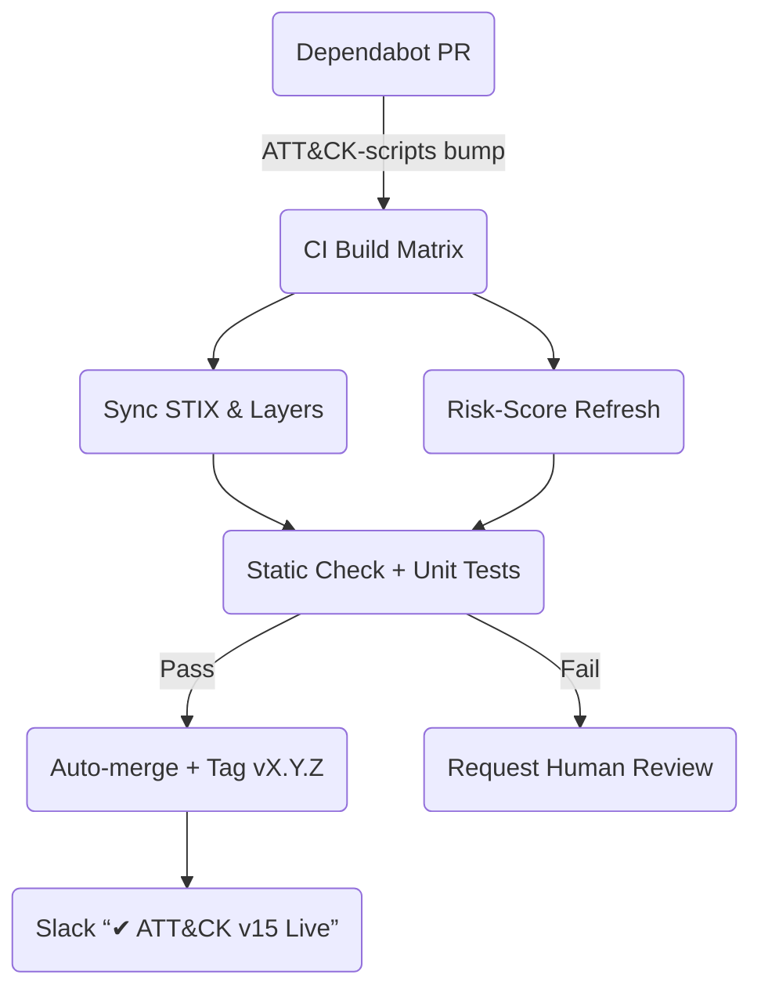

> “Humans approve the PR; robots do everything else.”  
> — DevSecOps Lead

## 1 • Release‑Watch Strategies

| Method              | Pro / Con                                          | Setup           |
|---------------------|----------------------------------------------------|-----------------|
| **GitHub Webhook**  | Instant; needs self‑hosted listener                | `repo_release` event |
| **Dependabot**      | Native to GitHub; daily polling                    | `package-ecosystem: github-actions` |
| **Scheduled Cron**  | Simple; up to 1‑hour lag                           | Actions `schedule` |

We combine *Dependabot* + a **weekly cron** as safety net.

---

## 2 • End‑to‑End Pipeline (Birds‑Eye)



---

## 3 • Workflow File `/.github/workflows/attck-update.yml`

```yaml
name: ATT&CK Framework Update
on:
  workflow_dispatch:
  schedule: [{ cron: "20 4 * * 6" }]         # Saturday 04:20 UTC
  pull_request:
    branches: [main]
    paths: [".github/workflows/", "requirements.txt"]

env:
  PYTHON_VERSION: "3.11"

jobs:
  build:
    runs-on: ubuntu-latest
    steps:
      - uses: actions/checkout@v4

      - name: Setup Python
        uses: actions/setup-python@v5
        with: { python-version: ${{ env.PYTHON_VERSION }} }

      - name: Install Deps
        run: |
          pip install -r attack-scripts/requirements.txt
          pip install mitreattack-python pandas

      - name: Sync Latest STIX
        run: python attack-scripts/get_stix.py --domain enterprise-attack --output stix

      - name: Generate Layers
        run: |
          python attack-scripts/layer_from_stix.py \
            --bundle stix/enterprise-attack.json \
            --name "ATT&CK v15 All" \
            --output layers/attck_v15_all.json
          python scripts/build_delta.py  # creates delta_layer.json

      - name: Re‑calc Risk Scores
        run: python scripts/calc_risk.py

      - name: Static Validation
        run: python scripts/validate_layers.py layers/

      - name: Upload Artefacts
        uses: actions/upload-artifact@v4
        with:
          name: attck-build-${{ github.run_number }}
          path: |
            stix/*
            layers/*.json
            risk_scores.json

  auto-merge:
    needs: build
    if: ${{ github.event_name == 'pull_request' && success() }}
    runs-on: ubuntu-latest
    steps:
      - name: Enable Auto‑Merge
        uses: "peter-evans/enable-pull-request-automerge@v3"
        with: { merge-method: squash }

  notify:
    needs: [build]
    if: success()
    runs-on: ubuntu-latest
    steps:
      - name: Slack Notify
        uses: slackapi/slack-github-action@v1.24.0
        with:
          payload: |
            {
              "channel": "#release",
              "text": ":white_check_mark: ATT&CK update ${{ github.run_number }} succeeded – new layers live."
            }
        env:
          SLACK_BOT_TOKEN: ${{ secrets.SLACK_TOKEN }}
```

---

## 4 • Semantic Version Tagging

```bash
git tag -a attck-sync-v15.0.0 -m "ATT&CK v15 sync – 2025‑07‑28"
git push origin attck-sync-v15.0.0
```

*Downstream dashboards* pull **latest tag** not `main`, ensuring roll‑back is
one git revert.

---

## 5 • PR Template for Dependabot Bumps

`.github/PULL_REQUEST_TEMPLATE/attck.md`


### :rocket: ATT&CK Framework Upgrade  
* *Domain:* enterprise-attack  
* *Old Version:* 14.1  
* *New Version:* 15.0  
* *New Techniques Added:* 27  
* *Removed Techniques:* 3  

#### Validation
- [x] STIX schema passes
- [x] Delta layer generated
- [x] Risk scores refreshed

Merge once CI passes.


---

## 6 • Guardrails & Gates

| Gate                           | Fails When…                             |
|--------------------------------|-----------------------------------------|
| **`validate_layers.py`**       | Layer JSON missing required keys        |
| **Risk Regression**            | Mean residual risk ↑ > 5 % vs last tag  |
| **Coverage Drop**              | Coverage layer score ↓ > 2 points       |
| **Test Duration**              | Build > 60 min (runner capacity issue)  |

Escalate to *#sec‑eng* Slack on gate failure.

---

## 7 • Disaster‑Rollback Playbook

1. `git checkout attck-sync-prev-tag`  
2. `git revert -m 1 HEAD`  
3. `git push origin main`  
4. Re‑deploy Navigator & TAXII via Ansible playbook  
5. Post *“Rollback completed”* Slack message.

---

## 8 • Best Practices

| Topic              | Recommendation                                   |
|--------------------|--------------------------------------------------|
| **Release Notes**  | Parse `CHANGELOG.md` from MITRE; attach to PR     |
| **Dry‑Run Env**    | Stage pipeline on non‑prod Navigator first        |
| **Secrets Hygiene**| Store TAXII creds & Slack tokens in GitHub Secrets|
| **Time‑Box Tests** | Parallelise Atomics to keep CI under 45 minutes   |
| **Audit Trail**    | Use GitHub releases to archive layer artefacts    |

---

<div class="post-resources container">
  <h3>Resources</h3>
  <ul>
    <li><a href="https://github.com/mitre-attack/attack-scripts" target="_blank">attack‑scripts Toolkit</a></li>
    <li><a href="https://docs.github.com/en/actions" target="_blank">GitHub Actions Documentation</a></li>
    <li><a href="https://dependabot.com/" target="_blank">Dependabot Release Monitoring</a></li>
  </ul>
</div>

<a href="{{ site.baseurl }}/modules/13/grafana-elk-dashboards/" class="next-link">13.6 Grafana / ELK Dashboards →</a>