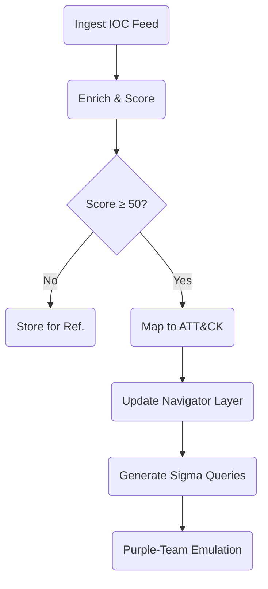

> “The higher you hunt on the pyramid, the more the adversary must *change*—and
> that’s where defenders win.”  
> — Threat‑Hunting Program Manager

## 1 • The Pyramid Refresher

| Level (Top → Bottom) | Indicator Type           | Adversary Cost to Change | ATT&CK Alignment Examples           |
|----------------------|--------------------------|--------------------------|-------------------------------------|
| **TTPs**             | Behavioural techniques   | **Weeks–Months**         | `T1059` Command Exec, `T1021` SMB    |
| **Tools**            | Malware/Framework        | High                     | Cobalt Strike, Impacket             |
| **Network/Host Artifacts** | Mutexes, registry keys | Moderate                | `HKLM\SYSTEM\CurrentControlSet\services\PortProxy` |
| **Domain Names**     | FQDN / sub‑domain        | Days                     | `login‑cdn.evil.net`                |
| **IP Addresses**     | IPv4/IPv6                | Hours                    | `198.51.100.23`                     |
| **File/Hash Values** | MD5/SHA‑256              | Seconds                  | `3fed…f15`                          |

*Goal*: spend analyst cycles on **TTP** & **Tool** layers—force costly rewrites.

---

## 2 • Indicator Scoring Model

```text
Indicator_Score = Confidence × (Pain_Factor ÷ Age_Decay)
```

| Indicator Type | Pain_Factor (0‑10) |
|----------------|--------------------|
| Hash           | 1                  |
| IP             | 2                  |
| Domain         | 3                  |
| Artifact       | 5                  |
| Tool           | 7                  |
| TTP            | 10                 |

*Age_Decay* = `e^(days/30)` to down‑rank stale IOCs.

### Python Snippet
```python
import math, datetime
def score(ioc_type, confidence, first_seen):
    pain = {"hash":1,"ip":2,"domain":3,"artifact":5,"tool":7,"ttp":10}[ioc_type]
    decay = math.exp((datetime.date.today()-first_seen).days/30)
    return round(confidence * (pain/decay),2)
```

---

## 3 • Mapping to ATT&CK in Practice

| Raw IOC           | Enrichment Step                                    | Pyramid Level | ATT&CK ID  |
|-------------------|----------------------------------------------------|---------------|------------|
| SHA‑256 hash      | MalwareBazaar → Family “Emotet”                    | **Tool**      | T1027 (Obfusc.) |
| IP 198.51.100.23  | Passive DNS → Domain `cdn‑up.evil.net`             | Domain        | —          |
| Mutex `Global\mssec`| Sandbox → Static artifact                         | Artifact      | T1055 (Inject) |
| Behaviour ‑ RDP login type 10        | Log pattern                     | **TTP**       | T1021.001 |

*Feed normaliser should up‑convert low‑level IOC to highest ATT&CK‑mappable
layer where possible.*

---

## 4 • SOC Workflow Example



*Result*: Only high‑pain indicators propagate to real‑time detections and
exercise plans.

---

## 5 • Splunk Query – Pain‑Weighted Alerting

splunk
| tstats summariesonly=true count FROM datamodel=Network_Traffic 
  WHERE All_Traffic.dest_ip IN ($ioc_list$)
| lookup ioc_scoring dest_ip OUTPUT score pyramid_level attack_technique_id
| where score>=50
| stats count BY dest_ip, pyramid_level, attack_technique_id


---

## 6 • Purple‑Team Application

1. **Select top‑scored TTPs** (≥ 80).  
2. **Build Atomic tests** (Atomic Red Team / CALDERA).  
3. **Run in lab → Validate detections**.  
4. **Feed gaps back to detection team**.

*Repeat monthly to mirror adversary evolution.*

---

## 7 • Mitigation & Best Practices

- **Automate Scoring** – daily job; manual overrides for high‑context intel.  
- **Archive Low‑Pain IOCs** – keep for retro‑hunt but don’t burn SOC cycles.  
- **Correlate Across Feeds** – multiple low‑pain hits to same host may escalate score.  
- **Report to CTI Sharing** – publish high‑pain, high‑confidence indicators via TAXII.

---

<div class="post-resources container">
  <h3>Resources</h3>
  <ul>
    <li><a href="https://detect-respond.blogspot.com/2013/03/the-pyramid-of-pain.html" target="_blank">David Bianco – Pyramid of Pain (2013)</a></li>
    <li><a href="https://attack.mitre.org/resources/working-with-attack/" target="_blank">MITRE – Working with ATT&CK</a></li>
    <li><a href="https://github.com/mitre-attack/attack-navigator" target="_blank">ATT&CK Navigator</a></li>
  </ul>
</div>

<a href="{{ site.baseurl }}/modules/9/campaign-tracking-clustering/" class="next-link">9.4 Campaign Tracking & Clustering →</a>