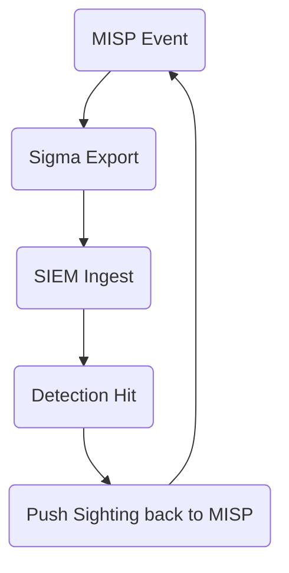

> “MISP is our clearing‑house—if it isn’t in there, it won’t reach the people
> who need it.”  
> — Threat‑Intel Operations Lead

## 1 • Why MISP?

| Benefit                      | How it Helps DFIR & SOC                                |
|------------------------------|--------------------------------------------------------|
| **Open‑Source Sharing Hub**  | Exchange intel bi‑directionally with partners & ISACs  |
| **ATT&CK Galaxies**          | Built‑in mapping objects (`attack‑pattern`)            |
| **Sightings & Scoring**      | Real‑time feedback loop on IOC usefulness              |
| **Rule Export**              | Auto‑generate Sigma, Suricata, YARA from attributes    |

---

## 2 • Initial Setup

```bash
# Debian/Ubuntu quick install
curl -fsSL https://raw.githubusercontent.com/MISP/MISP/2.4/INSTALL/INSTALL.sh | bash
```
# Enable ATT&CK & CAR galaxies
```sudo -u www-data /var/www/MISP/app/Console/cake \
        Admin updateGalaxies
```

- **Galaxies** → _ATT&CK_, _MITRE CAR_, _CAPE Malware_, etc.  
- Enable **taxii_default** module to pull from §9.5 TAXII server if desired.

---

## 3 • Import ATT&CK Bundles

```bash
# PyMISP example
from pymisp import ExpandedPyMISP
misp = ExpandedPyMISP(url, key, ssl=False)
misp.import_stix("beacon_bundle.json", pythonify=True, From='Attack CTI')
```

- Objects with `attack-pattern--*` IDs auto‑link to **ATT&CK galaxy** entries.  
- Tag the event with **TLP** marking and `Confidence=80`.

---

## 4 • Push Sightings from SOC

```python
# Add positive sighting on a file hash
misp.add_sighting({'value':'3fed…f15', 'type':'sha256',
                   'timestamp': int(time.time()),
                   'source':'Splunk-ES'})
```

*Benefit*: Up‑votes high‑pain indicators (§9.3) and down‑votes stale noise.

---

## 5 • Export Sigma & Suricata

| Export Type      | Menu Path                                   | Output File          |
|------------------|---------------------------------------------|----------------------|
| **Sigma**        | Event → `Download → Sigma rules`            | `event1234_sigma.yml`|
| **Suricata**     | `Download → IDS rules (Suricata/Snort)`     | `event1234.rules`    |
| **STIX 2.1**     | `Download → STIX v2 (bundle)`               | `event1234.json`     |

Automate nightly export via **misp-modules** REST `/query/export/sigma`.

---

## 6 • Workflow Integration



*Closed loop* keeps scoring & confidence fresh.

---

## 7 • Hunting Queries inside MISP

**Attribute Filter**  

type:ip-src AND galaxy:mitre-enterprise-attack AND
measured_score:>60 AND last_seen:<=7d

Returns high‑confidence attacker infra from past week mapped to ATT&CK.

---

## 8 • Best Practices & Governance

1. **Role‑Based ACLs** – read‑only for partners, read/write for internal CTI.  
2. **Event Publication Flow** – **Draft → Internal Review → Publish to Org → Publish to Community**.  
3. **Tag Hygiene** – enforce `tlp:*`, `confidence:*`, `attack‑pattern:*` on every attribute via **Object Template Rules**.  
4. **Automated Backups** – daily MariaDB dump + `app/files` to immutable store.  
5. **Performance** – enable Redis & ZMQ for fast sighting ingest (~10 k/s).

---

<div class="post-resources container">
  <h3>Resources</h3>
  <ul>
    <li><a href="https://www.misp-project.org/" target="_blank">MISP Official Site</a></li>
    <li><a href="https://github.com/MISP/MISP" target="_blank">MISP GitHub Repository</a></li>
    <li><a href="https://github.com/MISP/misp-modules" target="_blank">misp‑modules (Export & Enrichment)</a></li>
    <li><a href="https://www.misp-project.org/galaxy.html" target="_blank">MISP Galaxies – ATT&CK & Others</a></li>
  </ul>
</div>

<a href="{{ site.baseurl }}/modules/10/detection-engineering-car/" class="next-link">Module 10 Start → Detection Engineering & CAR →</a>